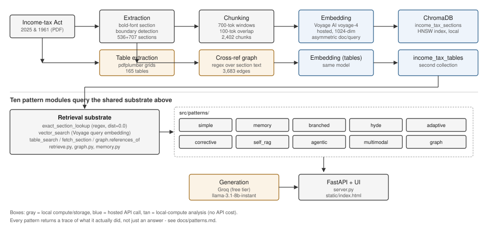
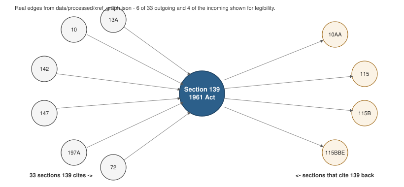
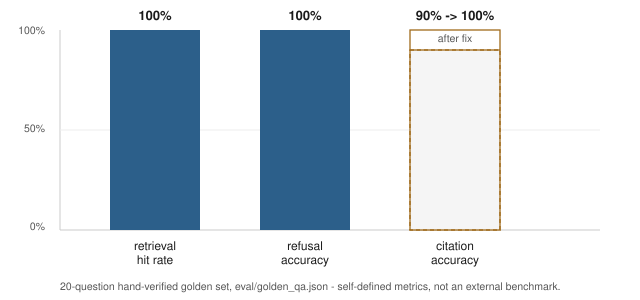

# TaxCite

A citation-grounded retrieval-augmented generation (RAG) system over Indian income tax law. Every answer traces back to an exact Act, chapter, and section of the Income-tax Act, 2025 or the superseded Income-tax Act, 1961 — and the system implements all ten commonly-cited RAG architectural patterns, plus three original patterns built on the same substrate, as selectable, independently verifiable pipelines over the same corpus, rather than picking one and stopping.

## Contents

1. [Why this project exists](#why-this-project-exists)
2. [Corpus](#corpus)
3. [Architecture overview](#architecture-overview)
4. [Extraction: from PDF to structured section](#extraction-from-pdf-to-structured-section)
5. [Chunking](#chunking)
6. [Embeddings](#embeddings)
7. [Vector store](#vector-store)
8. [Retrieval mechanics](#retrieval-mechanics)
9. [The ten RAG patterns](#the-ten-rag-patterns)
10. [Three inventions beyond the standard list](#three-inventions-beyond-the-standard-list)
11. [Evaluation](#evaluation)
12. [Bugs found and fixed during verification](#bugs-found-and-fixed-during-verification)
13. [Known limitations](#known-limitations)
14. [Interface](#interface)
15. [Running it](#running-it)
16. [Cost and infrastructure](#cost-and-infrastructure)
17. [What this project is trying to demonstrate](#what-this-project-is-trying-to-demonstrate)
18. [Planned work](#planned-work)

## Why this project exists

India's Income-tax Act, 2025 came into force on 1 April 2026. It replaced the Income-tax Act, 1961 with a substantially renumbered structure: 536 sections across 23 chapters, versus the older Act's 47 chapters and, by 2026, 800-plus sections after six decades of amendment. The renumbering is not cosmetic — a section number in one Act carries no relationship to the same number in the other. Section 139 of the 1961 Act governs the filing of a return of income. Section 139 of the 2025 Act concerns Special Economic Zone developer income. They are unrelated provisions that happen to share a number.

This matters for a language model specifically because the new Act's effective date (1 April 2026) falls after most current models' training cutoffs, including this assistant's own (January 2026). Asked "what does Section 194 of the new Act say," a base LLM has two ways to fail: it can answer from the old Act's Section 194 without noticing the substitution, or it can generate something plausible-sounding that matches neither Act. Both failures are silent — nothing in a fluent, confident answer signals that it is wrong. This was not left as a hypothetical. It was verified directly against this project's own base model: see [Bugs found and fixed](#bugs-found-and-fixed-during-verification) for a documented instance of exactly this failure occurring inside the system's own memory-rewrite path before a fix, and the [portfolio writeup](WRITEUP.md) for the original base-model test that motivated the whole project.

That is the argument for RAG here, tested rather than assumed:

- Every answer is grounded in text retrieved from the actual statute at query time, cited by Act, chapter, and section — a claim that can be checked against the source, not a claim that has to be trusted.
- The system sidesteps the knowledge-cutoff problem entirely, because it indexes current text directly instead of relying on anything memorized during training.
- It can say "not found in the indexed source" instead of fabricating a section number. In a legal or tax context, a fabricated citation that reads as confident prose is the most expensive possible failure mode, because the reader has no local signal that anything is wrong.
- When the Finance Act next amends a provision, the fix is re-indexing updated text. No retraining, no waiting on the next model release.

## Corpus

| Source | Act No. | Sections indexed | Role | Provenance |
|---|---|---|---|---|
| Income-tax Act, 2025 | 30 of 2025 | 536 (100% of the Act) | Current law | [ICAI-hosted PDF](https://resource.cdn.icai.org/87647dtc-aps2139-inceome-tax-act-2025.pdf), as enacted August 2025 |
| Income-tax Act, 1961 | 43 of 1961 | 707 | Superseded law, kept for comparison | [India Code bitstream](https://www.indiacode.nic.in/bitstream/123456789/2435/1/a1961-43.pdf) |

Both are government or statutory-body text, public domain under the Copyright Act 1957, section 52(1)(q).

The 1961 Act source is worth a specific note, because it contradicted its own filename. The bitstream is labelled as the original 1961 enactment, but extraction surfaced sections that could not have existed in 1962 — section 92CE (transfer-pricing secondary adjustment, added by the Finance Act 2017) and section 10BA among them. The India Code copy is a consolidated text with six decades of amendments folded in, not a frozen original. That makes it a better source for a "how did this provision evolve" comparison than a literal 1962 print would have been, but the metadata claim was checked against the content rather than trusted.

**Deferred: Income-tax Rules, 1962.** The only scriptable source located — a "compiled amendments" bundle from a High Court's public document server — turned out, once downloaded and read, to be a chronological stack of individual amendment notifications and bilingual ITR form schedules rather than consolidated rule-by-rule text. It was not usable as a retrieval corpus and was excluded rather than indexed anyway and left as a known gap. See `data/sources.json` for the specific reasoning.

## Architecture overview



*Gray boxes are local compute or storage; blue boxes are hosted API calls; tan boxes are local-compute analysis with no API cost.*

Every one of the standard ten pattern modules in `src/patterns/` is built on the same four-piece substrate: an exact-match section lookup, a Voyage AI vector search, a table-modality vector search, and a cross-reference graph traversal. The patterns differ only in *how* they call into that substrate — how many times, in what order, with what intermediate reasoning. This is a deliberate design choice: building ten independent retrieval systems would multiply the surface area for extraction and indexing bugs by ten; building one substrate and ten call patterns on top of it means a fix to retrieval (see the Act-starvation bug below) benefits every pattern simultaneously, and was in fact discovered through exactly that shared-code path. The three additional patterns beyond the standard list ([below](#three-inventions-beyond-the-standard-list)) reuse this same substrate rather than adding a second one — Jury RAG calls three existing patterns directly, and Correspondence and Precedent RAG reuse `retrieve.fetch_section`, `graph.py`, and `generate.llm`/`build_user_prompt` exactly as the standard ten do.

## Extraction: from PDF to structured section

The naive approach to segmenting a PDF into legal sections is a text-pattern regex: match a line starting with a number followed by a period. That approach was tried first and rejected on measured evidence — a regex pass over the flattened Income-tax Act, 1961 text produced 5,471 candidate section boundaries. The true number is 707. The difference is almost entirely Schedule tables and cross-reference lists, where "5. Any payment from an approved fund" or "see sections 194, 194A, 194D" both match the same surface pattern as a real section header.

The signal that actually discriminates a real section boundary from this noise is not textual, it is typographic. Every source PDF in this project sets real section numbers in a bold font; Schedule and table row numbers are set in the regular weight of the same font. This was confirmed by direct inspection of the PDF's character-level font metadata (`pdfplumber`'s `extract_words(extra_attrs=["fontname"])`) before it was relied on as a signal — Section 29's number in the 2025 Act renders in `KTEUID+TimesNewRomanPS-BoldMT`, while a numbered Schedule row a few pages later renders the same digit shape in `GVZREL+TimesNewRomanPSMT`, the regular variant. `src/extract.py` walks each page's word stream and treats a bold digit token at the start of a line as a section boundary; everything else is body text or noise to be discarded.

The 2025 Act's source PDF adds a second real complication: it is typeset in the two-column Gazette-of-India layout, with a narrow marginal-caption column running down whichever page edge is the outer edge of that particular page (the side alternates, matching a physically bound volume's printing convention). A naive per-page column split fails because the caption column's side is not fixed. The working approach clusters each page's words by x-coordinate, repeatedly peeling off small, narrow clusters (a caption is a handful of short stacked words) until only the wide main-text column remains, then falls back to a per-line scan for the rarer case where a caption survives the page-level pass glued to the front of a section-start line.

**Extraction yield, before and after the font-metadata approach:**

| Metric | Naive regex on flattened text | Font-metadata boundary detection |
|---|---|---|
| Candidate boundaries, 1961 Act | 5,471 | 824 (before dedup) |
| True sections recovered, 1961 Act | not meaningfully computable — too much noise | 707 |
| True sections recovered, 2025 Act | — | 536 of 536 (100%) |

Reaching 100% coverage on the 2025 Act took three further rounds of fixing silent data loss, each caught by manually tracing a specific missing section back to the source PDF rather than accepting an aggregate count:

1. A per-line fallback was needed for lines where a short margin caption survived the page-level column split glued to a section's opening line — recovered sections 19, 23, and similar cases that were otherwise silently absorbed into the preceding section's text.
2. A first content-length sanity ceiling of 8,000 characters, intended to catch runaway extraction bugs, instead silently discarded legitimately long sections.
3. A second ceiling at 40,000 characters still discarded Section 139 of the 1961 Act — "Return of income," 43,850 characters after sixty years of Finance Act amendments layered onto one provision. The eventual fix removed the length ceiling entirely; no fixed number is a sound heuristic for how long a real statutory section can legitimately run.

## Chunking

This is not semantic chunking, and the distinction is worth stating precisely rather than glossing over, because "semantic chunking" is a specific technique — splitting text at points where sentence-embedding similarity drops, so that each resulting chunk covers one coherent idea — and it is not what this project does.

The reasoning: a statute's citable unit is the section, full stop, independent of whether the section's internal sentences are topically homogeneous. Splitting Section 139 at an embedding-detected topic boundary partway through its enumeration of filing conditions would produce two chunks that are individually more topically coherent and simultaneously less useful, because neither one is "Section 139" anymore for citation purposes. The physical structure the legislature imposed on the text is a stronger and more relevant signal than any signal a general-purpose sentence embedding model could discover post hoc.

What the pipeline actually does, in two stages:

1. **Structural chunking at extraction time** (`src/extract.py`): one chunk per section, exactly as bounded by the bold-font detection above. This is the retrieval and citation unit throughout the system.
2. **Token-window sub-chunking at index time** (`src/embed.py`, `split_long_text`): any section exceeding 700 tokens is split into overlapping windows of 700 tokens with a 100-token overlap, counted with `tiktoken`'s `cl100k_base` encoding. This exists purely to keep individual embeddings semantically focused — a 43,850-character section embedded as one vector would blur together every sub-topic the section touches, degrading the specificity of the resulting similarity search. The overlap exists so a fact straddling a window boundary is not lost to either window.

Every sub-chunk retains its parent section number, Act, and chapter in ChromaDB metadata, so a retrieval hit on any window of Section 139 still cites as "Income-tax Act, 1961, Section 139" — the sub-chunking is invisible at the citation layer by design.

## Embeddings

Text embedding maps a passage of text to a point in a high-dimensional vector space (1,024 dimensions here) such that passages with similar meaning map to nearby points. "Nearby" is measured as the cosine of the angle between two vectors:

```
similarity(a, b) = (a . b) / (|a| |b|)
```

ChromaDB's default index reports this as a distance rather than a similarity — smaller is closer, with an exact match at distance 0.0. This project's retrieval logic reasons about that distance directly (see [Retrieval mechanics](#retrieval-mechanics) below).

**Model: Voyage AI's `voyage-4`, hosted, not local.** This project's zero-budget constraint means "free," not "must run on this machine" — moving compute off a personal machine to a free hosted API is a deliberate preference stated explicitly for this project, not an assumption. Two other options were tried first and rejected on measured, not theoretical, grounds:

- Google's Gemini Embedding API advertises a general free-tier request allowance that reads as generous, but the *embedding endpoint specifically* enforces a separate, undocumented cap of 1,000 requests per day — visible only in the full structured error body (`quotaId: EmbedContentRequestsPerDayPerUserPerProjectPerModel-FreeTier`), not in any rate-limit page found by searching. The corpus needed roughly 2,400 requests to index once; the quota made a same-day build impossible.
- Voyage AI's free tier without a payment method on file throttles hard: 3 requests per minute and 10,000 tokens per minute. A payment method lifts this while token usage stays free either way — but asking for one was treated as out of scope for a project whose entire premise is zero monetary exposure, not zero *current* spend. See the [ambitious-scope and free-resources discussion](WRITEUP.md) for the reasoning in full. The index build runs at the throttled rate instead: batches of 10 texts, paced 21 seconds apart, taking roughly ninety minutes for the full corpus. The build is resumable and persists incrementally per batch specifically because a multi-hour run against a hard-throttled API needs to survive an interruption without losing completed work.

**Asymmetric encoding.** Voyage's API accepts an `input_type` parameter distinguishing `"document"` from `"query"`. The two are encoded differently internally — a section of statute and a colloquial question about it are not symmetric in surface form even when they are semantically related, and encoding them with different instructions measurably improves retrieval quality over treating query and document text identically. Every document was embedded with `input_type="document"` at index time; every query is embedded with `input_type="query"` at search time. Mismatching the two would silently degrade every retrieval in the system without raising an error, which is why `retrieve.py` centralizes the query-side embedding call in one function (`embed_query`) rather than leaving each pattern to call the embedding API independently.

## Vector store

**ChromaDB**, running as a local, embedded, SQLite-backed store — not a hosted vector database.

The reasoning, stated as a comparison rather than a default: a hosted vector database (Pinecone, Weaviate, Qdrant Cloud) exists to solve problems this project does not have — concurrent writes from multiple application instances, managed high availability, a network-shared index serving many machines. At 2,567 total indexed items across two collections (2,402 section chunks, 165 table chunks), a local HNSW index answers a query in low tens of milliseconds, and there is no second writer to coordinate with. Reaching for a hosted vector database at this scale would reintroduce a paid-service dependency, and quite possibly a slower query path over a network hop, for a capability nothing in the system's actual usage pattern requires.

Two ChromaDB collections exist: `income_tax_sections` (prose) and `income_tax_tables` (the multi-modal pattern's structured-table index — see below). Both use ChromaDB's default index, an implementation of **Hierarchical Navigable Small World (HNSW)** graphs: an approximate-nearest-neighbor structure that organizes vectors into layered proximity graphs, letting a query descend from a coarse top layer to a fine bottom layer rather than comparing against every stored vector. This is what makes similarity search sub-linear in corpus size — a real requirement at web scale, and a convenience rather than a necessity at this project's scale, but a "free, local, and already correct" choice does not need to also be minimal to be the right one.

**Metadata filtering** is the specific ChromaDB feature this project actually depends on beyond plain similarity search — `collection.get(where={...})` is a first-class query path, not a bolt-on, and it is what makes the exact-section-lookup fast path (below) possible without hand-rolling a separate index.

## Retrieval mechanics

Retrieval combines two genuinely different mechanisms, and the reason for combining them is a measured failure of the simpler one, not a theoretical concern.

**The failure, measured directly.** A query like "what does section 194 say" is semantically generic — it names a number, not a topic — so a general-purpose similarity search cannot reliably distinguish it from other text that merely *mentions* the number 194 in passing. This was confirmed by direct measurement rather than assumed: the true Section 194 of the 2025 Act sat at a materially worse cosine distance from that query than an unrelated 1961-Act section (197A) that happened to list "194, 194A, 194D" in a cross-reference clause. Section 197A won the similarity search. The correct section did not even appear in the top result.

**The fix.** `retrieve.py`'s `exact_section_lookup` scans the query text for the pattern `section <number>` via regex, and when found, fetches that section directly from ChromaDB by metadata filter — `collection.get(where={"section": "194"})` — bypassing embedding similarity entirely. A metadata-filtered fetch cannot be wrong about which section it retrieved; the resulting chunk is tagged with distance `0.0` to make the guaranteed nature of the match visible in every trace. When the query also names which Act ("the 2025 Act," "Income-tax Act, 1961"), a second regex narrows the fetch to that Act specifically.

**Composition.** `search()` runs the exact lookup first; if it returns fewer than `top_k` results, plain vector search fills the remaining slots, deduplicated by chunk ID. A query that never names a section number (a topical question like "who has to file a return") skips the exact path entirely and relies on vector search alone — a real, documented, and currently unfixed gap, since a well-phrased topical query can still miss the best-matching section the way any pure similarity search can. Closing this gap is the natural next step and is exactly the kind of failure hybrid BM25-plus-vector retrieval exists to catch; it is listed under [Planned work](#planned-work) rather than silently left unmentioned.

The confidence gate that decides whether to answer at all or refuse (`DISTANCE_REFUSAL_THRESHOLD` in `src/generate.py`) is embedding-model-specific and was recalibrated against real evaluation failures, not picked once and left alone — see [Evaluation](#evaluation).

## The ten RAG patterns

There is a commonly cited list of ten RAG architectures — Simple, Memory, Branched, HyDE, Adaptive, Corrective, Self-RAG, Agentic, Multi-modal, and Graph. Most RAG projects implement one. This project implements all ten as independently selectable pipelines over the same corpus and the same retrieval substrate, specifically so their behavior is comparable rather than asserted.

Every pattern returns a `trace` object alongside its answer — the sub-questions it asked, the chunks it graded and why, the references it followed, the tool calls it made. This exists because a ten-pattern system is only an honest demonstration if a reader can see what each pattern actually did on a given query, not only its final text; the same answer text could in principle be produced by a pattern doing real work or one doing none, and the trace is what distinguishes the two.

| Pattern | Mechanism | Module |
|---|---|---|
| Simple | Retrieve once, generate once. The validated baseline every other pattern is compared against. | `patterns/simple.py` |
| Memory | Rewrites a follow-up question into standalone form using session history before retrieving, so "what about the old Act?" resolves correctly. | `patterns/memory_rag.py`, `src/memory.py` |
| Branched | Decomposes a multi-part question (an explicit old-Act-versus-new-Act comparison, for instance) into per-branch sub-questions, retrieves each independently, merges. | `patterns/branched.py` |
| HyDE | Drafts a hypothetical statutory passage answering the question, embeds *that* passage, and searches with its vector instead of the question's. | `patterns/hyde.py` |
| Adaptive | Classifies the query (comparison, vague, follow-up, rate lookup, out-of-scope, or ordinary) and routes to the pattern suited to that category. | `patterns/adaptive.py` |
| Corrective | Grades every retrieved chunk for relevance to the actual question before generation; rewrites the query and retries once if too few chunks pass. | `patterns/corrective.py` |
| Self-RAG | Drafts an answer, then critiques every claim in it against the retrieved source text, regenerating if any claim is unsupported. | `patterns/self_rag.py` |
| Agentic | The model drives a bounded tool loop — search, fetch an exact section, follow its cross-references, or finish — choosing each step itself, up to five steps. | `patterns/agentic.py` |
| Multi-modal | Searches prose sections and a separate structured-table index together, in one combined result set. | `patterns/multimodal.py`, `scripts/build_tables.py` |
| Graph | Expands the top retrieval hits one hop along real statutory cross-references before generating, pulling in sections the seed hits legally depend on. | `patterns/graph_rag.py`, `src/graph.py` |

Two of these carry a deliberate caveat rather than a straight claim, stated here rather than left implicit:

**Multi-modal** does not mean images or audio — a statute corpus has neither, and claiming otherwise would be decorative. It means the two representations this corpus genuinely has: prose section text, and the rate-schedule and cross-reference tables that the prose extraction pipeline reads as garbled noise. This is a *documented, reproduced* failure, not a hypothetical one — Section 194 of the 2025 Act references a rate table whose rows, when flattened into prose the same way section text is, produced repetitive garbled fragments that caused the generation model to loop on a nonsense repeated-"194" output in manual testing. `scripts/build_tables.py` extracts the same PDFs' tables structurally instead, using `pdfplumber`'s table-grid detector, serializing each table as pipe-delimited rows that preserve column structure, and indexes the 165 resulting tables in a second ChromaDB collection tagged `modality="table"`. The multi-modal pattern searches both collections with one shared query embedding and merges the results.

**Adaptive** is a real router — one LLM classification call, or a zero-cost regex short-circuit when the query already names a section number — not a hardcoded if/else dressed up as a pattern. But it is a small model's single-call judgment across a handful of categories, not a learned routing policy, and its decision is always recorded in the trace precisely so a wrong route is visible rather than silently absorbed into an answer that happens to still sound plausible.

### The cross-reference graph



Statutory text is naturally a graph. Section 139 does not exist in isolation — it explicitly invokes Section 10 (exempt income), Section 142 (assessment procedure), Section 197A (a form declaration), and thirty of its own peers by number, in its own text. Vector similarity is structurally blind to this: understanding Section 139 in full genuinely requires Section 511, say, but the two sections' texts are not written to *sound* alike, only to be legally coupled. No amount of embedding-similarity search discovers a relationship the text states explicitly by number but does not restate in prose.

`src/graph.py` extracts this graph with a regex over the sections' own already-extracted text — `\bsections?\s+(...)`, filtered against each Act's real, known section-number set so extraction noise cannot fabricate an edge to a section that does not exist. That filter mattered in practice: an unfiltered first pass produced 149 spurious edges to a nonexistent "Section 1," traced to sub-section markers like "511(1)" being read as a reference to section "1" before the parenthesized qualifier was stripped. The final graph holds 3,683 real edges across 876 sections with at least one outgoing reference — entirely local computation, no API cost, rebuilt from the already-extracted text in under a second.

The Graph pattern uses this by taking the top retrieval hits for a query, following each one's outgoing references one hop, and pulling the first chunk of each referenced section into the generation context alongside the seed hits. One hop only, by design: a statute's reference closure is dense enough that a second hop would pull a large fraction of the surrounding Act into context for a single question, which stops being retrieval and starts being "attach most of the corpus."

## Three inventions beyond the standard list

The ten patterns above are a commonly cited list; implementing all ten is thoroughness, not invention. Three further patterns were built specifically because they are not on that list, do not exist elsewhere in the system, and were each chosen because this project's own premise — a statute that was wholesale renumbered, not just re-dated — makes them genuinely useful rather than decorative additions.

| Pattern | Mechanism | Module |
|---|---|---|
| Jury | Runs Simple, Corrective, and Graph RAG on the same question and votes on which `(act, section)` each one's top result lands on. 2-or-3-of-3 agreement is reported as consensus; anything less is reported as explicit disagreement, not silently resolved. | `patterns/jury.py` |
| Correspondence | Answers "what's the 2025-Act equivalent of this 1961-Act section" — a real question the renumbering makes hard, that nothing else in the system answers. Backed by an offline-built map of the ~50 most-cited 1961 sections to their verified 2025 equivalents. | `patterns/correspondence.py`, `scripts/build_correspondence.py` |
| Precedent | Attaches real, sourced Supreme Court case law to a retrieved statute section, when one is linked. | `patterns/precedent.py`, `scripts/build_cases.py` |

**Jury RAG** treats agreement between independently-reasoning patterns as a real confidence signal instead of each pattern silently committing to one answer with no way to express uncertainty. It runs sequentially, not in parallel — Voyage's free tier is 3 requests/minute, so three concurrent embedding calls would just be rate-limit-queued anyway, and sequential execution costs nothing extra in wall clock. Verified live against three real scenarios: unanimous 3/3 consensus (an exact section-number query, and a capital-gains query landing all three jurors on Section 45), a genuine 2/3 split (an insurance-payout query where Corrective's re-grading diverged from Simple and Graph's shared top hit), and a full 3/3 refusal (a rate-table question none of the three text-only jurors could answer, since rate schedules live in a separate table modality). True 3-way disagreement turns out to be structurally rare by this design: Simple and Graph both derive their vote from the identical un-graded `search()` call, so only Corrective's independent grading-and-retry path can actually diverge from the other two.

**Correspondence RAG** is backed by `data/processed/correspondence_map.json`, built offline in three steps that keep the expensive part (LLM verification) cheap: (1) the ~50 most-cited 1961-Act sections by in-degree in the existing cross-reference graph — a data-driven proxy for "foundational provision" rather than guessing section numbers a general-purpose model might recall wrong given the renumbering; (2) 2025-Act candidates generated with **zero new embedding calls** — every chunk of a section's already-computed vectors is mean-pooled into one representative vector and used to query the `itact2025`-filtered collection, reusing vectors already paid for during the original index build; (3) one Groq call per section verifying whether each top-3 candidate functionally corresponds, with a confidence label and rationale. Every answer carries a fixed disclaimer: this is an LLM-verified functional mapping, not an official concordance table.

Step (2)'s mean-pooling was not the first version — it was a fix for a real bug caught during manual verification (this project's verification standard applies to the new patterns too, not only the original ten). The first build embedded only a section's *first* chunk to generate candidates and truncated its text to 1,200 characters for verification. For an ordinary, narrowly-scoped section this is fine; for one of the ~25 of 50 top-cited sections that are large omnibus sections — Section 2's 37-chunk general-definitions clause, Section 10's 73-chunk exemptions list — it badly misrepresents the section's actual scope. Verified live: Section 2 (the 1961 Act's definitions section) was graded a "strong" match to Section 405 of the 2025 Act (an advance-tax computation formula) purely because Section 2's *first defined term* happens to be "advance tax" — the verifier was judging one clause among dozens as if it were the whole section. Mean-pooling every chunk's vector, sampling text across multiple chunks instead of a flat prefix, and adding an explicit caution to the verifier prompt about omnibus sections together fixed this: re-verified, Section 2 correctly returns no strong match at all, an honest reflection that the corpus has no single clean 2025-Act equivalent for a definitions section this broad.

**Precedent RAG** is the one addition that adds new corpus content rather than a new way of calling existing content, and case citations are the one failure mode this project treats as worse than any other — a fabricated court citation reads exactly as confident as a real one. Every case name, citation, and holding in `data/processed/cases.jsonl` was sourced from [itatonline.org's digest of landmark Supreme Court tax judgments](https://itatonline.org/digest/articles/landmark-supreme-court-judgments-relevant-to-day-to-day-tax-practice-under-the-income-tax-act-2025-and-income-tax-act-1961/), then individually cross-checked against a secondary source (indiankanoon.org and/or independent web corroboration) before being written anywhere — not generated or recalled from model memory. This caught a real error: the digest listed *Vodafone International Holdings v. UOI* without a clear year; IndianKanoon's own judgment record and independent corroboration confirmed the actual decision date as 20 January 2012, not the digest's apparent "2003." The citation itself (341 ITR 1) was correct — only the year was wrong, and it was corrected rather than the case being dropped, since the cross-check resolved cleanly.

Section links in `case_graph.json` went through the same discipline as the correspondence map, but by manual reading rather than an LLM confidence label — a case-to-section link is exactly the kind of claim this project's premise says must be checked, not asserted. Candidate sections were generated by embedding each case's holding and querying the existing section index (the one exception to "zero new embedding calls," since case text has no pre-existing vector), then every candidate's actual section text was read before a link was kept. This caught cases where the nearest vector match was topically adjacent but substantively wrong — *Vodafone*'s nearest hit by vector distance was an unrelated capital-gains exemption clause; the section that actually embodies the case's principle (the GAAR "commercial substance" test, itact1961 Section 97 / itact2025 Section 180) ranked lower by distance but was the correct link on reading both. Two of the eighteen cases (*CIT v. Excel Industries*, *CIT v. Vegetable Products*) turn on a general interpretive principle rather than any single operative provision, and no candidate for either was a genuine match on manual reading — both ship with no linked section rather than a forced weak match; the pattern says so plainly ("no linked precedent for this section") rather than silently answering statute-only with no explanation.

## Evaluation



**Scope.** This formal quantitative eval is scoped to Simple RAG, as it already was before the three new patterns — extending the golden-set methodology to all thirteen patterns would be a real, separate effort, not something to fold in silently. The new patterns were held to the manual, real-query verification standard described in the section above instead, applied consistently across all three rather than unevenly.

**Methodology.** `eval/golden_qa.json` holds twenty hand-written questions with verified ground-truth Act-and-section answers. Every answer was checked against real, already-extracted section content rather than assumed from general tax-law knowledge — a meaningful constraint specifically for the 2025 Act, whose section titles live in the PDF's marginal-caption column, which is deliberately excluded during extraction (see [Extraction](#extraction-from-pdf-to-structured-section)) because it interleaves unpredictably with body text. Ground truth for those questions was built by reading actual section bodies directly, not by trusting a title field that does not exist for that Act.

Three metrics were chosen over a RAGAS-style faithfulness score, deliberately: this project's actual value proposition is citing the correct Act and section, and RAGAS's metrics are tuned for general prose faithfulness rather than statutory citation accuracy specifically. A custom, narrower metric that measures the thing the project claims to do was judged more honest than an off-the-shelf score that measures something adjacent.

| Metric | Definition | Result |
|---|---|---|
| Retrieval hit rate | Was the correct section present anywhere in the top-5 retrieved chunks | 100% (20/20) |
| Refusal accuracy | Did genuinely out-of-corpus questions (a cookie recipe; a GST rate, which is a different Act entirely) get correctly refused rather than answered | 100% (2/2) |
| Citation accuracy | Did the generated answer explicitly cite the correct section | 90% initially, 100% after a fix (see below) |

**These are self-defined metrics against a hand-built golden set, not scores against an external benchmark.** There is no standard public benchmark for a bespoke income-tax RAG system, so a claim of "passing the highest score" would have nothing real to be measured against. What is reported here is a precise description of what was actually checked, not a claim calibrated to sound more authoritative than the measurement supports.

**The citation-accuracy gap was a real bug, not measurement noise.** All three failing questions on the first full run shared one root cause: retrieval had already found the correct section in every case (hit rate was already 100% before this was noticed), but the system refused to answer anyway. `DISTANCE_REFUSAL_THRESHOLD` — the cosine-distance cutoff below which the system trusts a match enough to answer — had been calibrated at 0.9 for a different embedding model, before the Voyage AI switch, and never re-checked against Voyage's actual distance distribution. Direct measurement showed genuinely relevant Voyage matches scoring 0.7 to 1.15, while verified off-corpus queries scored 1.2 to 1.4 — the old threshold of 0.9 sat inside the relevant range, rejecting real matches. Recalibrating to 1.15 and individually re-verifying all three previously-failing questions closed the gap to 100%.

Full per-question results are in `eval/results.json`.

## Bugs found and fixed during verification

Building all ten patterns was followed by exercising each one individually with a real query chosen to trigger its specific mechanism — not a smoke test confirming the code runs, a test designed to catch the pattern doing the wrong thing while still producing plausible-looking output. This surfaced two real defects, both fixed and independently re-verified afterward rather than assumed fixed once the code changed.

**Act-starvation in the exact-section lookup.** When a section number exists in both Acts — as many do, since both run from section 1 upward — `exact_section_lookup` originally sorted every matching chunk by `(act_id, chunk_index)` before truncating to `top_k`. Because `"itact1961"` sorts alphabetically before `"itact2025"`, and Section 139 of the 1961 Act alone spans far more chunks than most `top_k` values (it is 43,850 characters, recall), the 1961 Act's chunks could fill the entire result before the 2025 Act's version of the same section was ever considered. This was caught directly: "What does section 139 of the Income-tax Act 2025 say?" silently returned only 1961-Act text, and the model correctly — but unhelpfully — reported that it could not find Section 139 in the 2025 Act at all, because the 2025 Act's real content for that section had never reached it. The fix interleaves chunks round-robin across Acts before truncating, rather than sorting flat and slicing. Because this function is shared by the original Simple RAG pipeline as well as every new pattern, the fix improves retrieval project-wide, not just in the newly-added patterns.

**Groq's JSON mode hard-fails instead of degrading.** Groq's structured-output mode can return a `400 json_validate_failed` error — a truncated JSON object cut off mid-generation by the token budget — as a hard API exception rather than returning the truncated text for a caller to salvage. This is not the same failure class as malformed-but-present JSON, which the system already handled by regex-extracting the largest `{...}` block from the response text. `self_rag`'s self-critique step, which asks the model to verify its own draft against the sources, hit exactly this failure and crashed the entire pattern rather than degrading gracefully. The fix was made once, at the shared `llm()` call in `src/generate.py`, converting the hard API exception into the same `ValueError` every JSON-mode caller across all ten patterns already knows how to catch — a single fix at the point of shared risk, rather than a defensive try/except scattered across each pattern module individually.

## Known limitations

Stated directly rather than left for a reader to discover:

- **Topical queries that never name a section number rely on vector search alone**, which can still miss the best-matching section the way any pure similarity search can — the exact-lookup fast path only triggers when a query names a number explicitly. Hybrid BM25-plus-vector retrieval is the standard fix and is not yet built; see Planned work.
- **Margin-note text occasionally bleeds into section body text.** The two-column Gazette layout's caption-exclusion pass is not perfect; a verified case reads "...no loss which has return for losses. not been determined..." where "return for losses" is a stray caption fragment interleaved mid-sentence. Accepted as residual noise rather than chased further, given diminishing returns against the extraction effort already invested.
- **Prose retrieval of table-heavy sections can still surface garbled text.** The multi-modal pattern's separate table index works around this for queries it handles, but a prose-only pattern (Simple, for instance) retrieving Section 194 of the 2025 Act directly still gets the same section's prose form, tables included, exactly as originally extracted.
- **Income-tax Rules, 1962 is not indexed at all** — see Corpus. No procedural or forms-level coverage exists in the current corpus.
- **The classifier behind the Adaptive pattern is a single small-model call**, not a learned or extensively-tuned router; its category boundaries are reasonable defaults, not something separately validated the way retrieval and citation accuracy were.

## Interface

A small FastAPI backend (`server.py`) serving a single-page vanilla-JavaScript frontend (`static/index.html`) — no framework, no build step. This replaces an earlier Streamlit implementation, removed once the project outgrew a single-pipeline demo: Streamlit's execution model reruns the entire page script on every interaction, which fits a single input-to-output flow well and fights a system with ten differently-shaped pipelines, each needing to expose a different trace structure alongside its answer. A plain page gives direct control over rendering that trace data next to the answer instead of working around a framework built for a different shape of problem.

The interface exposes a pattern selector, a live trace panel showing the selected pattern's internal steps for the most recent answer, and source badges on every answer distinguishing a prose hit, a table hit, and a graph-expansion hit from each other.

## Running it

```bash
pip install -r requirements.txt
```

Requires two free API keys, neither requiring a payment method:

- `VOYAGE_API_KEY` — [voyageai.com](https://www.voyageai.com), 200 million free tokens
- `GROQ_API_KEY` — [console.groq.com/keys](https://console.groq.com/keys)

```bash
python scripts/download_sources.py    # fetch the two Act PDFs
python scripts/build_chunks.py        # extract + chunk into data/processed/
python src/embed.py                   # build the prose vector index (resumable)
python scripts/build_tables.py        # extract tables
python src/embed.py --tables          # build the table vector index
python src/graph.py                   # build the cross-reference graph
python -m uvicorn server:app --port 8600
```

## Cost and infrastructure

Zero monetary budget, held to throughout rather than relaxed when it became inconvenient: free hosted APIs for anything compute-heavy (Voyage AI for embeddings, Groq for generation), local storage and computation for everything else (ChromaDB, the cross-reference graph, table extraction), and no payment method entered anywhere in the stack — a boundary held even where entering one would have unlocked faster rate limits at no additional monetary cost, because the ask itself was judged out of scope for a project whose entire premise is zero financial exposure.

## What this project is trying to demonstrate

Not "a RAG system that answers tax questions" as the end in itself — that is the vehicle, not the point. Three things this project is built to show, each backed by something concrete rather than asserted:

**That RAG's value case can be tested, not just claimed.** The opening argument of this README is falsifiable: does the target Act's effective date actually fall after a base model's training cutoff, does the base model actually confuse the two Acts' section numbering when asked directly. Both were checked before being stated as the project's premise, not assumed because they sounded plausible.

**That a system's own claims should be checked against its own behavior, not against its design intent.** The two bugs documented above were found by deliberately trying to make each pattern fail in the specific way its mechanism would fail if broken, not by confirming each pattern's code ran without an exception. A pattern that runs without crashing and a pattern that does what it claims are different claims, and only checking the first one is how confident-sounding, wrong output survives into a demo.

**That an honest limitations section is more informative than a longer feature list.** Every section of this document that says "this doesn't work yet" or "this was a real bug, here is exactly what broke" is deliberate. A citation-grounded system whose own documentation will not tell you where the citations can still go wrong has not actually demonstrated the discipline it claims to bring to the underlying problem.

## Planned work

1. Hybrid BM25-plus-vector retrieval, closing the topical-query gap that Simple and Adaptive's default route both inherit.
2. Table-aware extraction inside the prose pipeline itself, rather than only in a separate table index that a non-multi-modal pattern never consults.
3. A better source for the Income-tax Rules, 1962, so procedural and forms-level questions become answerable.
4. Public deployment — not yet done; needs a free hosting sign-in this assistant cannot complete on the user's behalf.
5. A learned or more rigorously validated router for the Adaptive pattern, rather than a single small-model classification call.

See [WRITEUP.md](WRITEUP.md) for the portfolio narrative version of this project, including the specific base-model test that motivated it and the infrastructure friction (rate limits, a Windows file-lock, a mid-session pivot from an entirely different project) that shaped how it was actually built.
